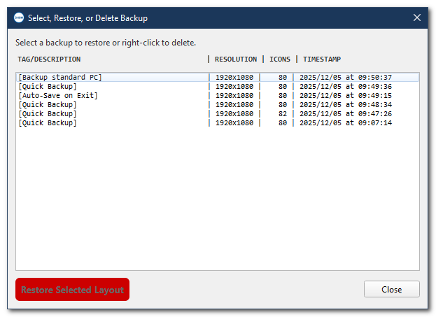
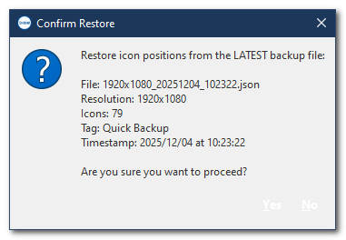
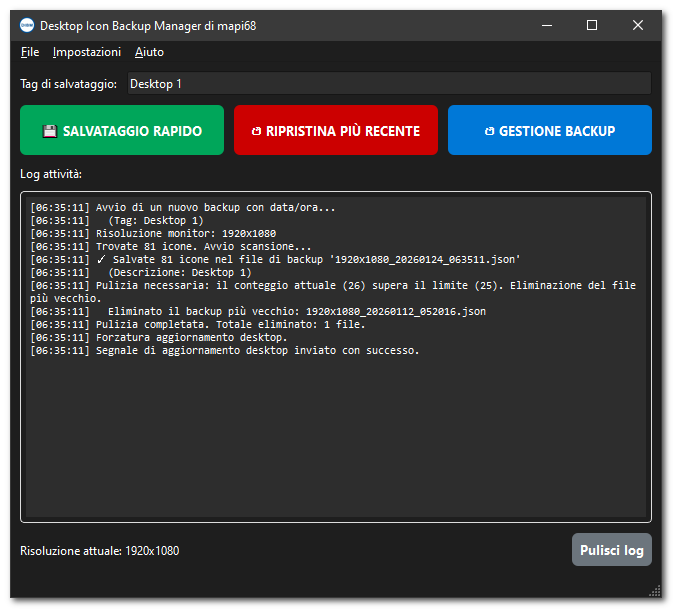

# Desktop Icon Backup Manager

A powerful Windows application to save and restore your desktop icon positions with advanced features like automatic backups, system tray integration, and adaptive scaling for multi-monitor setups.


[](releases)
[](releases)
[](commits/master)
[](releases)
---

## 🌟 Features

### Core Functionality
- **💾 Quick Backup**: Save your desktop icon layout with a single click
- **↺ Restore Options**: Restore from the latest backup or choose from a list of saved configurations
- **🏷️ Custom Tags**: Add descriptive tags to your backups for easy identification
- **📊 Resolution Tracking**: Automatically records screen resolution with each backup

### Advanced Features
- **🖼️ Visual Layout Preview**: See a mini-map of your icon arrangement before restoring
- **🔄 Adaptive Scaling**: Automatically adjusts icon positions when restoring to different screen resolutions
- **🖥️ Multi-Monitor Support**: Detects and handles multiple monitor configurations
- **🗑️ Smart Cleanup**: Automatic deletion of old backups (configurable limits: 5, 10, 25, 50, or unlimited)
- **⚡ System Tray Integration**: Run minimized in the background with quick access to save/restore

### Automation
- **Auto-Save on Exit**: Automatically backup your layout when closing the application
- **Auto-Restore on Startup**: Automatically restore your layout when the application starts
- **Background Operations**: Non-blocking operations with progress indicators

### User Experience
- **Dark Theme Support**: Adapts to your Windows theme preferences
- **Keyboard Shortcuts**: `Ctrl+S` for quick save, `Ctrl+Q` to exit
- **Detailed Activity Log**: Track all operations with timestamped entries
- **Confirmation Dialogs**: Prevent accidental overwrites or deletions

## 📋 Requirements

- Windows 10 or later
- Python 3.8+ (for running from source)
- Desktop icons must be visible (not hidden)

## 🚀 Installation

### Option 1: Download Pre-compiled Executable (Recommended)
1. Download the latest `DesktopIconBackupManager.exe` from the [Releases](../../releases) page
2. Extract in a folder
3. Run the executable - no installation required!

### Option 2: Run from Source
1. Clone this repository:
   ```bash
   git clone https://github.com/mapi68/DesktopIconBackupManager.git
   cd DesktopIconBackupManager
   ```

2. Install dependencies:
   ```bash
   pip install -r requirements.txt
   ```

3. Run the application:
   ```bash
   python DesktopIconBackupManager.py
   ```

### Dependencies
```
PyQt6
pywin32
```

## 📖 Usage Guide

### Basic Operations

#### Saving Your Layout
1. Click **"💾 SAVE QUICK BACKUP"** for an instant backup with timestamp

#### Restoring Your Layout
1. Click **"↺ RESTORE LATEST"** to restore from the most recent backup
2. Or click **"↺ BACKUP MANAGER"** to choose from all available backups

### Advanced Features

#### System Tray Usage
- **Minimize to Tray**: Close the window (when "Minimize to Tray" is enabled in Settings)
- **Quick Actions**: Right-click the tray icon for quick save/restore options
- **Double-Click**: Restore the main window

#### Settings Menu

**Auto-Save/Auto-Restore**
- ✅ **Auto-Save on Exit**: Automatically creates a backup when closing the app
- ✅ **Auto-Restore on Startup**: Automatically restores the latest backup on launch

**Adaptive Scaling**
- ✅ **Enable Adaptive Scaling on Restore**: Automatically adjusts icon positions when restoring to a different screen resolution
  - Example: Backup saved at 1920x1080 → Restored at 2560x1440

**Backup Management**
- **Automatic Cleanup Limit**: Choose how many backups to keep (5, 10, 25, 50, or unlimited)
- Oldest backups are automatically deleted when the limit is reached

**Startup Behavior**
- ✅ **Start Minimized to Tray**: Launch the app in the system tray

**Window Behavior**
- ✅ **Minimize to Tray on Close**: Hide to tray instead of closing when clicking 'X'

### Backup File Format

Backups are stored in the `icon_backups` folder as JSON files with the format:
```
[Resolution]_[Timestamp].json
Example: 1920x1080_20240315_143022.json
```

Each backup contains:
- Icon positions (name and coordinates)
- Display metadata (resolution, monitor count)
- Custom description/tag
- Timestamp

## ⚙️ Configuration

Settings are automatically saved to `settings.ini` in the application directory:

```ini
[General]
auto_save_on_exit=true
auto_restore_on_startup=false
adaptive_scaling_enabled=true
cleanup_limit=10
start_minimized=false
close_to_tray=true
```

## 🔧 Keyboard Shortcuts

| Shortcut | Action |
|----------|--------|
| `Ctrl+S` | Quick Save |
| `Ctrl+Q` | Exit Application |

## 🐛 Troubleshooting

### Icons not restoring correctly?
- Ensure desktop icons are visible (not hidden)
- Check that the Activity Log for any error messages
- Try disabling "Auto-arrange icons" in Windows desktop settings

### Application won't start?
- Make sure no other instance is running
- Check that you have the required permissions
- Verify that desktop icons are enabled in Windows

### Multi-monitor issues?
- Enable "Adaptive Scaling" in Settings for automatic position adjustment
- Note: Backup saves the configuration from the time it was created
- Restoring with different monitor setup may require manual adjustments

## 🤝 Contributing

Contributions are welcome! Please feel free to submit a Pull Request.

1. Fork the repository
2. Create your feature branch (`git checkout -b feature/AmazingFeature`)
3. Commit your changes (`git commit -m 'Add some AmazingFeature'`)
4. Push to the branch (`git push origin feature/AmazingFeature`)
5. Open a Pull Request

## 📝 License

This project is licensed under the MIT License - see the [LICENSE](LICENSE) file for details.

## 👤 Author

**mapi68**

## 🙏 Acknowledgments

- Built with PyQt6 for the modern GUI
- Uses Win32 API for desktop icon manipulation
- Inspired by the need to preserve desktop layouts across resolution changes

## 📸 Screenshots
# Desktop Icon Backup Manager

<p align="center">
  
  <br><br>
  <em>Main interface showing the activity log and three main action buttons</em>
  <br><br><br>
</p>

<p align="center">
  
  <br><br>
  <em>Backup Manager window with list of saved backups and layout preview</em>
  <br><br><br>
</p>

<p align="center">
  
  <br><br>
  <em>Confirmation dialog before restoring a backup</em>
  <br><br><br>
</p>

<p align="center">
  
  <br><br>
  <em>Desktop Icon Backup Manager featuring dark mode and Italian support</em>
  <br><br><br>
</p>

---

**Note**: This application directly interacts with Windows desktop icon positions. Always keep recent backups before making system changes.
